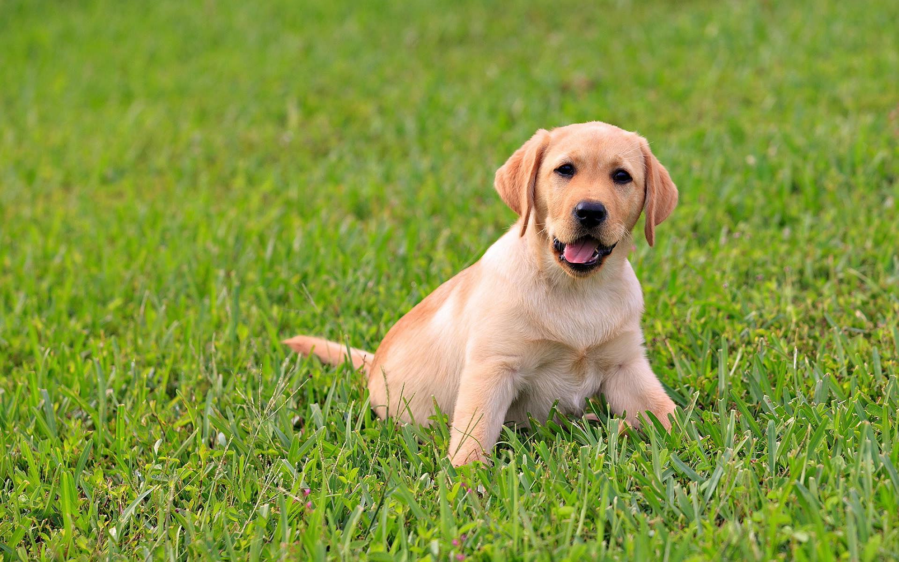

```{r, echo = F}

```

Welcome to Wandering Labs Lab! We are a small, independent lab lead by John Santerre, PhD. Conceived as an opportunity to provide a cross-over learning experience between students and foster a PhD-like experience (albeit in a remote fashion), Wandering Labs is a place for Masters graduates to work and prepare before moving on to their PhD graduate experience. We are actively looking to involve other PhD’s to help support and guide early stage researchers, and for small grants to support students while they conduct research. Often our work centers around bio and medical Machine Learning applications, but as the name “wandering” suggests, we research a diverse range of topics, and are specifically interested in working where theory informs application, and application theory.

# Why Wandering Lab?

Santerre = without earth, we are not constrained by any org, research whatever (someone fix this)


# Contact

We need contact!
